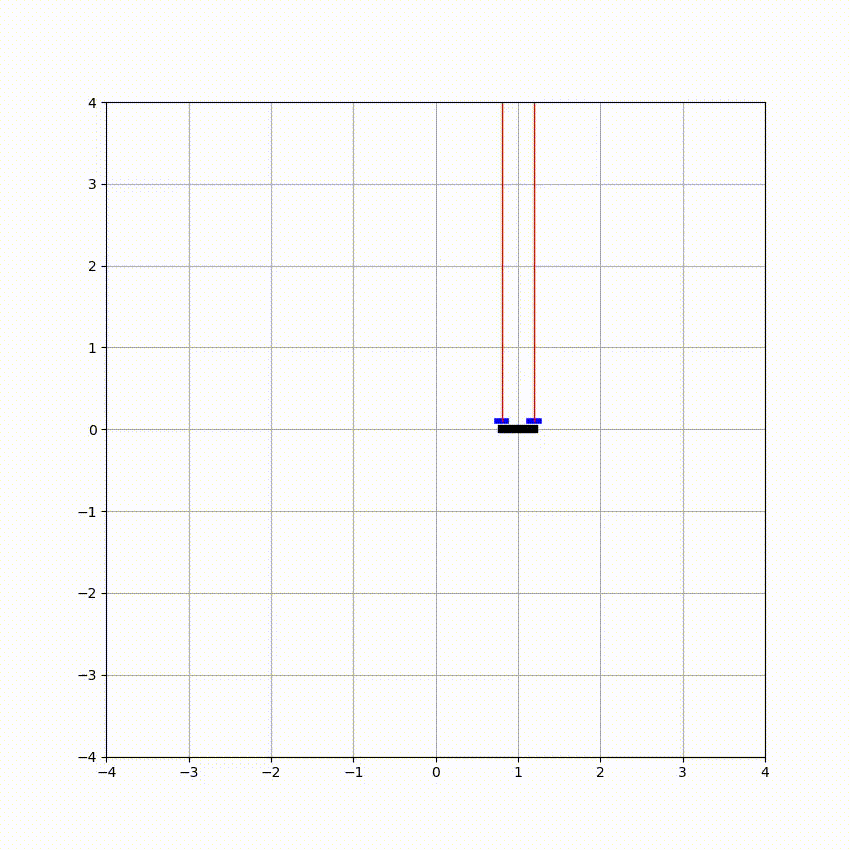
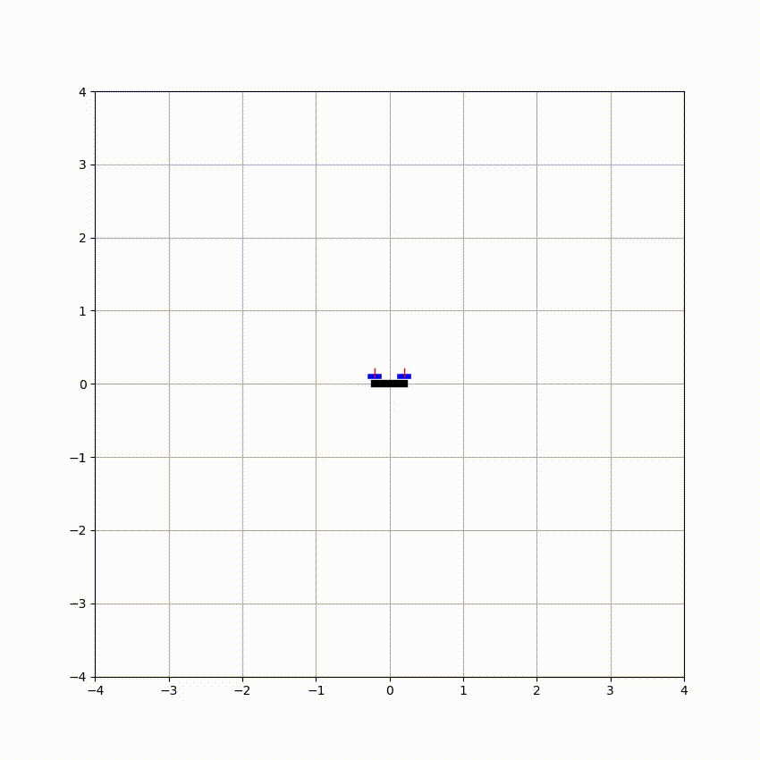

# Acrobatic-Control-of-a-2D-Quadrotor
Acrobatic control of a 2D quadrotor refers to the ability of the quadrotor to perform complex, dynamic maneuvers such as flips and turns. In this project, we designed and implemented two controllers for a 2D quadrotor to enable it to perform acrobatic maneuvers: a Linear-Quadratic Regulator (LQR) controller and an iterative LQR (iLQR) controller with added line search. The LQR controller was designed to maintain a predefined position and follow a predefined trajectory, while the iLQR controller was developed to perform acrobatic maneuvers and avoid local minima. 

<!-- 

  

   -->

|
 :--:|:--:
  *Following Trajectory* |*Doing Flip*
  
## Tracking Controller using LQR

For the Linearized Quadratic controller, we must compute the value of A and B at each stage of the trajectory as it is dependent on the state of the system.

To make quadrotor follow a trajectory first system dynamics have to be linearized around the desired states and desired controls are different time steps.

Linearized system dynamics can be written as - 
$$\bar{x_{n+1}} = A_n\bar{x_{n}} + B_n\bar{u_{n}}$$
where,

$A_n =  \frac{\partial f}{\partial x}$ linearized around $x_{n}^{*}, u_{n}^{*}$, 

$B_n =  \frac{\partial f}{\partial u}$ linearized around $x_{n}^{*}, u_{n}^{*}$, 

$$x_{n}^*, u_{n}^*$$  are the desired state and desired control to follow the trajectory. 

Cost function for controller can be written as -
$$ \sum_{n=0}^{N} (x_n - x^*_n)^TQ_n(x_n-x^*_n) + (u_n-u^*_n)^TR_n(u_n-u^*_n)$$

To make quadrotor follow a circle desired state at different time steps
$$z_n^* = \begin{bmatrix}\cos{\frac{2\pi*1000}{n}} \\
0\\
\sin{\frac{2\pi*1000}{n}} \\
0\\0\\0\end{bmatrix}$$
desired control was taken to as - 
$$u_n^* = \begin{bmatrix}\frac{mg}{2}\\ \frac{mg}{2}\end{bmatrix}$$

The cost function to make quadrotor follow the trajectory can be written as - 
$$ \sum_{n=0}^{N} (x_n - x^*_n)^TQ_n(x_n-x^*_n) + (u_n-u^*_n)^TR_n(u_n-u^*_n)$$
subjected to 
$$\bar{x_{n+1}} = A_n\Bar{x_{n}} + B_n\Bar{u_{n}}$$
