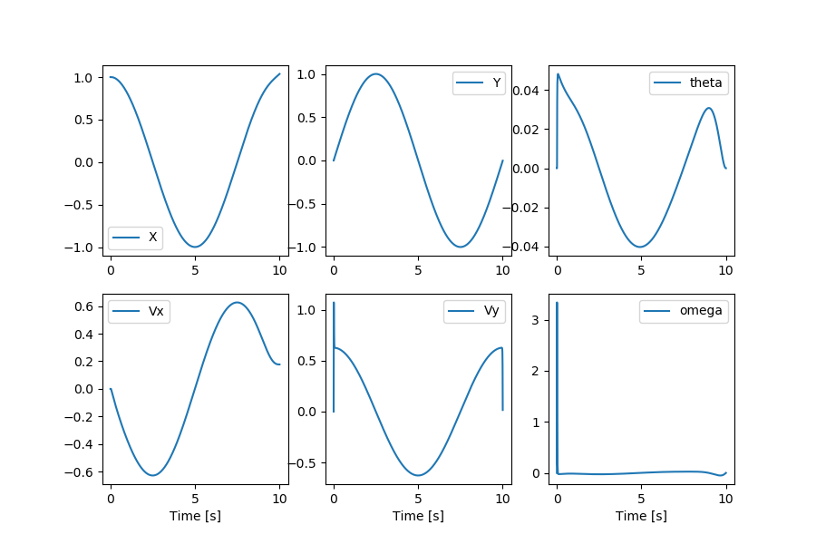
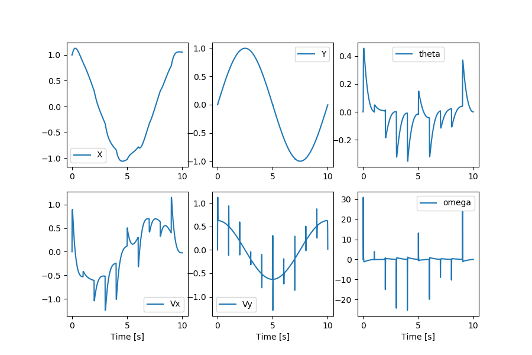
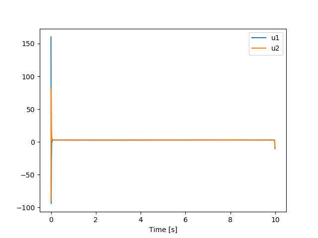
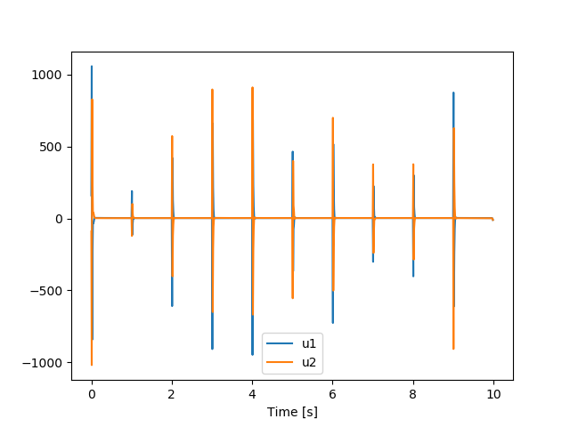
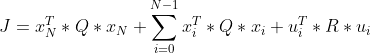
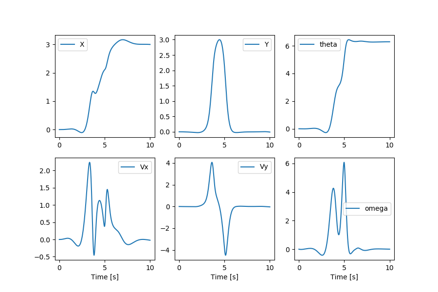
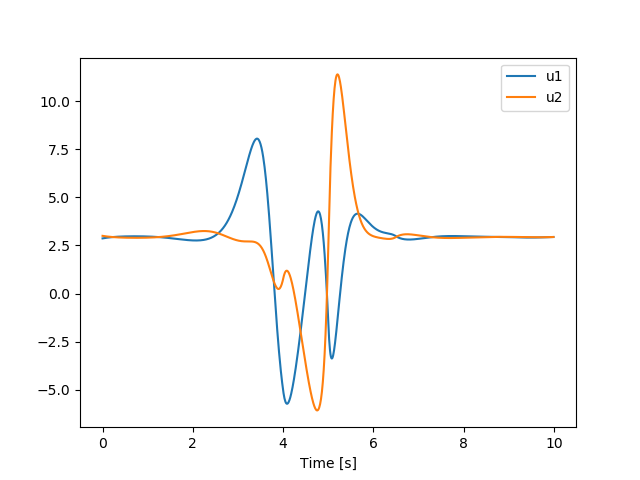

# Acrobatic-Control-of-a-2D-Quadrotor
Acrobatic control of a 2D quadrotor refers to the ability of the quadrotor to perform complex, dynamic maneuvers such as flips and turns. In this project, we designed and implemented two controllers for a 2D quadrotor to enable it to perform acrobatic maneuvers: a Linear-Quadratic Regulator (LQR) controller and an iterative LQR (iLQR) controller with added line search. The LQR controller was designed to maintain a predefined position and follow a predefined trajectory, while the iLQR controller was developed to perform acrobatic maneuvers and avoid local minima. 

<!-- <p align = 'center'>

  
</p>   -->

|
 :--:|:--:
  *Following Trajectory using LQR* |*Doing Full Flip using iLQR*
  
## Tracking Controller using LQR

For the Linearized Quadratic controller, we must compute the value of A and B at each stage of the trajectory as it is dependent on the state of the system.

To make quadrotor follow a trajectory first system dynamics have to be linearized around the desired states and desired controls are different time steps.

Linearized system dynamics can be written as - 
$$\bar{x_{n+1}} = A_n\bar{x_{n}} + B_n\bar{u_{n}}$$
where,

$A_n =  \frac{\partial f}{\partial x}$ linearized around $x_{n}^\star, u_{n}^\star$, 

$B_n =  \frac{\partial f}{\partial u}$ linearized around $x_{n}^\star, u_{n}^\star$, 

$x_{n}^\star, u_{n}^\star$  are the desired state and desired control to follow the trajectory. 

Cost function for controller can be written as -

$$\sum_{n=0}^{N} (x_n - x^\star_n)^TQ_n(x_n-x^\star_n) + (u_n-u^\star_n)^TR_n(u_n-u^\star_n)$$

To make quadrotor follow a circle desired state at different time steps
                 

$$x_n^\star = \begin{bmatrix}\cos{\frac{2\pi*1000}{n}} \\
0\\
\sin{\frac{2\pi*1000}{n}} \\
0\\
0\\
0\end{bmatrix}$$

desired control was taken to as - 

$$u_n^\star = \begin{bmatrix}\frac{mg}{2}\\ 
\frac{mg}{2}\end{bmatrix}$$

### Plots of States for following circular trajectory 
|
 :--:|:--:
  *without perturbations* |*with perturbations*

### Plots of controls for following circular trajectory
|
 :--:|:--:
  *without perturbations* |*with perturbations*
  
## Acrobatic Controller using iLQR  
The cost function computes the total cost of trajectory $x$ with control trajectory $u$. It consists of two parts, i.e. cost to go and terminal cost. This cost function will be used in the next steps to compute $Q, R, q, r$ using Hessian and Jacobian.

The equation of time-varying cost function is given by :
<p align = 'center'>

</p> 

The function can be found in the ipynb file with the following name:
```python
 compute_cost(z, u, horizon_length):
``` 

The quadratic approximation is used to find the value of Q, q, R, and r.
Q and R are the hessian while q and r are the jacobians of cost function J.
Where,
$$Q = \frac{\partial^2 J}{\partial x^2} $$
$$R = \frac{\partial^2 J}{\partial u^2} $$
$$q = \frac{\partial J}{\partial x} = Q * (x^* - x_{desired})$$
$$r = \frac{\partial J}{\partial u} = R * (u^* - u_{desired})$$

The function can be found in the ipynb file with the following name:
```python
 get_quadratic_approximation_cost(z, u, horizon_length):
```
The function for iLQR algorithm can be found in the ipynb file with the following name:
```python
 solve_iLQR(A, B, Q, R, q, r, N):
```

### Plots for doing full flip without perturbations
|
 :--:|:--:
  *States* |*Controls*
